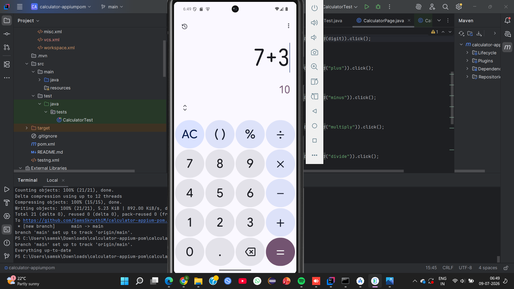
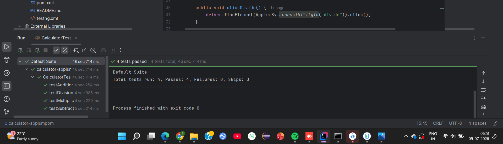

# 📱 Calculator App Automation using Appium

This is a mobile automation project I built to automate the native **Google Calculator** app on an Android Emulator using **Appium**, **Java**, and **TestNG**. The project follows the **Page Object Model (POM)** design pattern to keep the framework clean, organized, and easy to maintain.

The framework automates basic arithmetic operations—addition, subtraction, multiplication, and division—and verifies that the displayed results match the expected values using TestNG assertions.

---

## 🚀 Tech Stack

- Java 17
- Appium
- Selenium
- TestNG
- Maven
- Android Studio Emulator
- IntelliJ IDEA

---

## 📂 Project Structure

```
calculator-appium-pom
│
├── images
├── videos
├── src
│   ├── main
│   │   ├── java
│   │   │   ├── base
│   │   │   ├── pages
│   │   │   └── utils
│   │   └── resources
│   │
│   └── test
│       └── java
│           └── tests
│
├── testng.xml
├── pom.xml
└── README.md
```

---

## 📌 Features

- Automates the Google Calculator application
- Built using the Page Object Model (POM)
- Executes tests on an Android Emulator
- Uses TestNG for assertions and test execution
- Maven for dependency management
- Clean and reusable project structure

---

## 🧪 Test Cases

The project currently automates the following operations:

- ✔ Addition
- ✔ Subtraction
- ✔ Multiplication
- ✔ Division

Each test validates that the calculator displays the correct result.

---

## ⚙️ Prerequisites

Before running the project, make sure you have installed:

- Java JDK 17
- Android Studio
- Android Emulator
- Appium Server
- Maven
- IntelliJ IDEA

---

## ▶️ Running the Project

### 1. Clone the repository

```bash
git clone https://github.com/SamsSkruthiM/calculator-appium-pom.git
```

### 2. Start the Appium Server

```bash
appium
```

### 3. Launch the Android Emulator

Open Android Studio and start your emulator.

### 4. Verify the emulator connection

```bash
adb devices
```

Expected output:

```
emulator-5554    device
```

### 5. Run the tests

Run `CalculatorTest.java` from IntelliJ or execute:

```bash
mvn clean test
```

---

## ✅ Sample Output

```
Default Suite

Total tests run: 4
Passes: 4
Failures: 0
Skips: 0

BUILD SUCCESS
```

---

## 📖 Framework Structure

The framework is divided into three main components:

- **BaseTest** – Initializes and closes the Appium driver.
- **CalculatorPage** – Contains calculator locators and reusable actions.
- **CalculatorTest** – Contains all TestNG test cases and assertions.

This structure keeps the framework modular, maintainable, and easy to extend.

---

# 📸 Screenshots

## Project Structure


---

## Calculator App



---

## Test Results



---

# 🎥 Automation Demo

📹 **Watch the automation demo here:**

[▶️ Appium Calculator Automation Demo](videos/appium-calculator-demo.mp4)

---

## 🔮 Future Improvements

Some features I'd like to add in the future:

- Extent Reports
- Screenshot capture on test failure
- Jenkins CI/CD integration
- GitHub Actions workflow
- Data-driven testing
- Log4j logging
- Parallel test execution

---

## 👩‍💻 About Me

**Samskruthi M**

Information Science and Engineering student with an interest in **Software Testing**, **Mobile Automation**, **Java**, and **QA Automation**. I'm continuously learning and building projects to strengthen my automation testing skills.